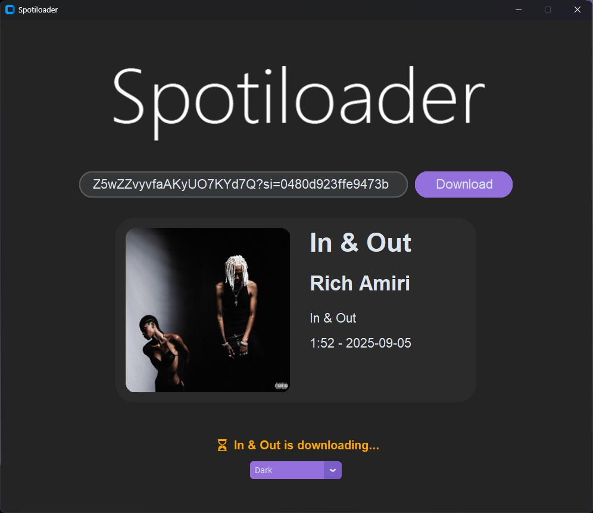
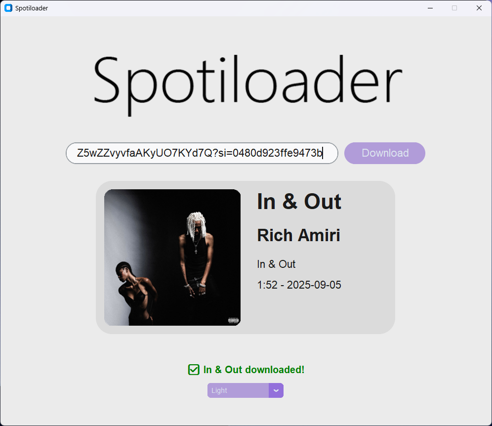

# 🎵 Spotiloader
[](https://customtkinter.tomschimansky.com/)
[](https://spotipy.readthedocs.io/en/2.25.1/)
[](https://mutagen.readthedocs.io/en/latest/)
[](https://github.com/yt-dlp/yt-dlp)
[](LICENSE)

**Spotiloader** — This is a simple GUI application (written in **CustomTkinter**) that allows you to:
- search for tracks by link from **Spotify**
- display information about the song (title, artist, album, cover, release date)
- download tracks using **yt-dlp**
- save them in a convenient **songs/** folder

<div align="center">
  

  *example of work*

  

  *example of work*
</div>

## ⚙️ Installation

### Clone the repository:
   ```bash
   git clone https://github.com/zkqw3r/Spotiloader
   cd spotiloader
   ```
### Create a virtual environment and install dependencies:

```bash
python -m venv venv
source venv/bin/activate   # Linux/Mac
venv\Scripts\activate      # Windows
```
```
pip install -r requirements.txt
```
### Create a .env file in the root of your project and specify your Spotify API keys:

```
clientId=your_client_id
clientSecret=your_client_secret
```

## ▶️ Start app
```bash
python app/gui.py
```

## 📂 Project structure
```bash
spotiloader/
│── app/
│   ├── gui.py          # GUI application
│   ├── downloader.py   # Download logic
│
│── logo/
│   ├── logo_d.png      # Logo for light theme
│   ├── logo_l.png      # Logo for dark theme
│
│── songs/              # Folder for downloaded tracks
│── lavender.json       # Application theme config
│── .env                # Spotify API Keys
│── requirements.txt    # Dependencies
```

## 📦 Dependencies
#### See requirements.txt for the full list:

- **customtkinter** — GUI

- **spotipy** — working with the Spotify API

- **yt-dlp** — loading tracks

- **mutagen** — tags for audio

- **pillow** — working with covers

- **requests**, dotenv etc.

## 📜 License
This project is licensed under the MIT License.
Feel free to use, modify and share.
